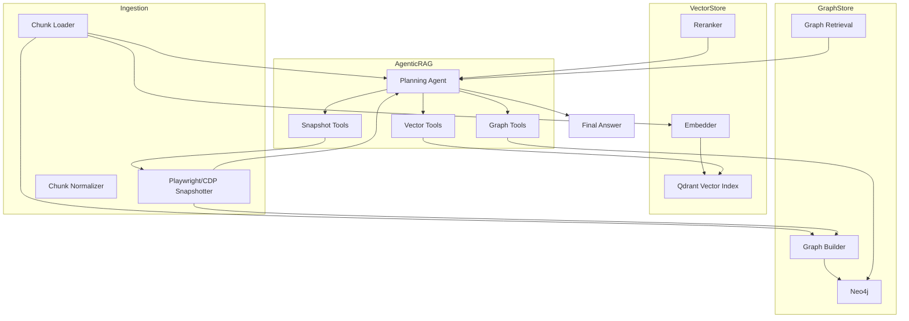

# # 📘 Full RAG System Implementation Guide

### *Vector RAG + Graph RAG + Agentic RAG with Python, LangChain, Qdrant, Neo4j, and Playwright/CDP*

---

This document provides a **complete, step-by-step implementation plan** for building a production-grade Retrieval-Augmented Generation (RAG) pipeline using:

* **Python**
* **LangChain**
* **Qdrant** (vector store)
* **Neo4j** (knowledge graph)
* **Playwright + Chrome DevTools Protocol (CDP)** (for frontend rendering introspection)
* **Chunk-based indexing** (your code chunks)
* **Reranking layer**
* **Agentic orchestration**

You can follow every phase without reading any prior conversation.

---

# # 📂 1. Directory Structure (Recommended Foundation)

```
rag-system/
├── docs/
│   ├── full_rag_system_implementation_guide.md
│   └── architecture.mermaid
│
├── data/
│   ├── chunks/
│   ├── snapshots/
│   ├── graph/
│   └── embeddings/
│
├── config/
│   ├── settings.yaml
│   └── secrets.env
│
├── src/
│   └── rag_pipeline/
│       ├── __init__.py
│       ├── config.py
│       ├── logging_config.py
│
│       ├── ingestion/
│       │   ├── chunk_loader.py
│       │   ├── snapshot_loader.py
│       │   └── preprocessors.py
│
│       ├── chunking/
│       │   ├── chunk_processor.py
│       │   ├── heuristics.py
│       │   └── normalization.py
│
│       ├── vector/
│       │   ├── embedder.py
│       │   ├── qdrant_client.py
│       │   ├── vector_indexer.py
│       │   └── reranker.py
│
│       ├── graph/
│       │   ├── graph_builder.py
│       │   ├── neo4j_client.py
│       │   ├── graph_schema.py
│       │   └── graph_retrieval.py
│
│       ├── render/
│       │   ├── playwright_snapshotter.py
│       │   ├── cdp_snapshotter.py
│       │   └── dom_extraction.py
│
│       ├── retrieval/
│       │   ├── hybrid_retrieval.py
│       │   ├── graph_vector_combiner.py
│       │   └── reranking_pipeline.py
│
│       ├── agents/
│       │   ├── planning_agent.py
│       │   ├── tool_registry.py
│       │   ├── vector_tools.py
│       │   ├── graph_tools.py
│       │   ├── snapshot_tools.py
│       │   └── agentic_rag.py
│
│       ├── api/
│       │   ├── server.py
│       │   └── routes.py
│
│       └── utils/
│           ├── types.py
│           ├── fs.py
│           ├── jsonl.py
│           └── hashing.py
│
├── docker/
│   ├── Dockerfile
│   ├── docker-compose.yaml
│   └── qdrant.dockerfile
│
└── scripts/
    ├── upload_chunks_to_neo4j.py
    ├── build_embeddings.py
    ├── run_agentic_rag.py
    └── snapshot_site.py
```

---

# # 🧱 2. Phase 1 — Foundations & Configuration

### **Step 1 — Install core dependencies**

* Python 3.10+
* LangChain
* Qdrant (local or cloud)
* Neo4j
* Playwright + CDP dependencies
* Your chosen embedding model provider (OpenAI, Ollama, HuggingFace)

---

### **Step 2 — Define configuration layer**

Create config settings for:

* Qdrant host + collection name
* Neo4j URI, username, password
* Embedding model name
* Chunk size + overlap
* Snapshotting viewports (desktop, mobile)

---

### **Step 3 — Enable structured logging**

Set up JSON logs for:

* Ingestion
* Embedding
* Graph building
* Agent reasoning (if stored)

---

# # 📥 3. Phase 2 — Chunk Ingestion Pipeline

### **Step 1 — Load `chunks.json` files**

Each chunk should contain:

* type
* name
* code
* file_path
* language
* qualified_name
* dependencies
* references
* defined symbols
* relationships
* context

---

### **Step 2 — Normalize chunk fields**

Ensure consistent fields for:

* identifiers
* edge relationship labels
* metadata flattening
* context expansion

---

### **Step 3 — Hash content for idempotency**

Generate chunk IDs using a SHA256 hash of:

* file_path
* start/end line numbers
* code content

---

# # 🧩 4. Phase 3 — Vector Store Indexing (Qdrant)

### **Step 1 — Prepare embeddings**

For each chunk:

* Extract embedding text (`code`, `docstring`, or relevant fields)
* Compute embeddings
* Store embedding vectors + metadata

---

### **Step 2 — Create Qdrant schema**

Metadata recommended:

* `id`
* `type`
* `name`
* `language`
* `file_path`
* `qualified_name`
* `dependencies`
* `references`
* `chunk_text_hash`

---

### **Step 3 — Upload vectors in batches**

---

### **Step 4 — Implement vector retrieval**

LangChain Qdrant retriever with:

* k-nearest neighbor
* metadata filtering
* score threshold

---

# # 🔗 5. Phase 4 — Knowledge Graph (Neo4j)

### **Step 1 — Define node types**

All chunks become `(:Chunk)` nodes with properties:

* id
* type
* language
* code
* metadata
* context

Referenced symbols become `(:Symbol)` nodes.

---

### **Step 2 — Define edge types**

Edges extracted from chunk fields:

* `DEPENDS_ON`
* `REFERENCES`
* `IMPORTS`
* `CALLS`
* `DECLARES`
* `INHERITS_FROM`
* `HAS_CHILD`
* `CHILD_OF`
* `REGISTERS_MODEL`
* `HAS_FIELD`
* `MATCHES_CSS`
* `RENDERS_TEMPLATE`

---

### **Step 3 — Upload graph**

Using a Python script:

* Create nodes
* Create edges
* Avoid duplicates using MERGE

---

### **Step 4 — Implement graph queries**

Examples:

* “Find all chunks related to X”
* “Find dependency chain for Y”
* “Find HTML elements affected by CSS selector Z”
* “Trace Django view → template → model relationships”

---

# # 🎭 6. Phase 5 — Rendering & CDP Snapshot Pipeline

### **Step 1 — Set up Playwright + Chromium**

### **Step 2 — Capture snapshots**

For each target URL:

* outerHTML
* bounding box
* computed styles
* matched CSS rules
* screenshots
* cross-origin stylesheet retrieval
* DOM tree extraction

---

### **Step 3 — Store snapshot metadata**

Convert snapshot into chunk-like entries:

* type: `"computed_snapshot"`
* selector
* viewport
* computed_styles
* matched_rules
* screenshot path

---

### **Step 4 — Link snapshots to graph**

Create edges:

* `(:Chunk)-[:RENDERED_AS]->(:Snapshot)`
* `(:HtmlElement)-[:HAS_COMPUTED_STYLE]->(:Snapshot)`

---

# # 🔍 7. Phase 6 — Hybrid Retrieval (Vector + Graph + Snapshot)

### **Step 1 — Vector retrieve**

Initial semantic candidates.

### **Step 2 — Graph expand**

Neighborhood expansion up to N hops.

### **Step 3 — Snapshot enrich**

Attach computed styles / DOM info if relevant.

### **Step 4 — Rerank results**

Use a reranker (cross-encoder or LLM scoring) to order:

* semantic similarity
* graph connectivity
* relevance score
* viewport relevance (desktop/mobile)

---

# # 🤖 8. Phase 7 — Agentic RAG

### **Step 1 — Define agent tools**

#### Vector Tools

* search vectors
* semantic match
* rerank candidates

#### Graph Tools

* query related chunks
* dependency tracing
* inheritance traversal
* CSS→HTML matching

#### Snapshot Tools

* fetch computed style
* compare desktop/mobile
* detect layout issues

---

### **Step 2 — Create a planning agent**

A multi-step planner that understands:

* “Break task into steps”
* “Call correct tools”
* “Refine reasoning”
* “Validate output”

---

### **Step 3 — Implement orchestration**

Agent loops:

* Step → ToolCall → Observe → NextStep
  until solution is reached.

---

### **Step 4 — Build Agentic RAG pipelines**

Examples:

#### **Pipeline 1: Code Debugging**

* retrieve relevant chunks
* trace dependencies
* inspect related views/templates/models
* generate fix

#### **Pipeline 2: Frontend Visual Debugging**

* run snapshot for specific viewport
* inspect computed styles
* traverse CSS→HTML graph
* reason over layout failure

---

# # 🧪 9. Phase 8 — Evaluation & Testing

* Semantic retrieval accuracy tests
* Graph edge correctness
* Snapshot consistency
* Agent reasoning benchmarks
* UI debugging test suites

---

# # 📦 10. Phase 9 — Deployment & APIs

Expose:

### `/query/vector`

### `/query/graph`

### `/query/agent`

### `/query/snapshot`

Deploy via:

* Docker + Docker Compose
* API gateway
* Background workers for ingestion

---

# # 🖼️ Mermaid Architecture Diagram



---

# # 🎉 Conclusion

By following these phased steps, you can build a **complete multimodal RAG system** capable of:

* Semantic retrieval (Vector RAG)
* Structural reasoning (Graph RAG)
* Multi-step tool-based reasoning (Agentic RAG)
* UI debugging via browser rendering (Snapshot RAG)

This architecture supports **backend code**, **frontend code**, and **rendered behavior** — all powered purely by Python, LangChain, Qdrant, Neo4j, and Playwright.

---

# Want this converted into:

* A Notion-friendly version
* A printable PDF
* A project README
* A roadmap or implementation checklist
* A GitHub repository structure with placeholder files

Just tell me.
