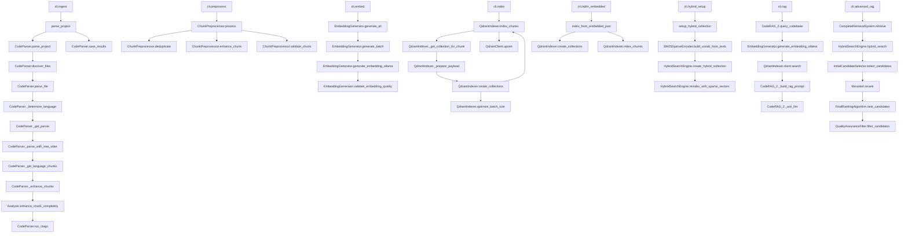

# Migration Plan: Updating .idea to rag2.mermaid Architecture

This document outlines the steps and considerations for updating the project's architecture documentation from `Rag.mermaid` to `rag2.mermaid` and for migrating from the current geminIndex structure to the more organized VibeIndex structure.

The file at `.idea` is not a typical IDE configuration directory but a text file containing a description of the project's RAG architecture. The migration involves updating this file to reflect the more advanced architecture defined in `rag2.mermaid`.

## Key Architectural Differences

The `rag2.mermaid` architecture introduces several key improvements over the older `Rag.mermaid` design:

1.  **Embedding Quality Validator**: A new component in the Embedding Layer to ensure the quality of generated embeddings.
2.  **Expanded Retrieval Process**: The original "Retrieval Layer" is now split into two distinct layers:
    *   **Initial Retrieval Layer**: Responsible for the initial candidate selection using hybrid search.
    *   **Reranking Layer**: A new, sophisticated layer to rerank the initial candidates for better relevance.
3.  **Detailed Reranking Layer**: The new Reranking Layer includes multiple components for advanced relevance tuning:
    *   Reranking Input Processor
    *   Cross-Encoder Model
    *   Relevance Scoring
    *   Semantic Similarity (Re-embedding)
    *   Final Ranking Algorithm
    *   Quality Assurance Filter

## Why VibeIndex Structure is Better

### 1. Clearer Separation of Concerns
- **Current Structure**: Components are mixed across modules (e.g., parsing, embedding, and retrieval logic scattered across src/preprocessing, src/embedding, src/retrieval)
- **VibeIndex Structure**: Each component has its own dedicated module with clear boundaries (parsers/, embedders/, indexers/, retrieval/, etc.)

### 2. Better Maintainability
- **Current Structure**: Multiple duplicate classes with `_2` suffixes (e.g., EmbeddingGenerator vs EmbeddingGenerator_2, QdrantIndexer vs QdrantIndexer_2)
- **VibeIndex Structure**: Single, focused implementations per concern with proper version management through configuration

### 3. Improved Testability
- **Current Structure**: Tightly coupled components make unit testing difficult
- **VibeIndex Structure**: Isolated modules allow for better unit testing and mock implementations

### 4. Extensibility
- **Current Structure**: Adding new parsers, embedders or indexers requires modifying existing files
- **VibeIndex Structure**: New implementations can be added as separate files without modifying existing code

### 5. Professional Standards
- **Current Structure**: Non-standard organization that doesn't follow Python packaging best practices
- **VibeIndex Structure**: Follows industry-standard patterns with clear module separation and proper package structure

### 6. Reduced Duplication
- **Current Structure**: Functionally identical methods duplicated across classes (e.g., enhance_chunk, validate_chunk)
- **VibeIndex Structure**: Single implementation per functionality with proper inheritance or composition

## Implementation Phases

### Phase 1 - Completed Components
- [x] **Reranking Layer Implementation**: All components have been implemented
  - [x] `src/reranking/input_processor.py` - Reranking Input Processor
  - [x] `src/reranking/cross_encoder.py` - Cross-Encoder Model
  - [x] `src/reranking/scoring.py` - Relevance Scoring
  - [x] `src/reranking/semantic_similarity.py` - Semantic Similarity (Re-embedding)
  - [x] `src/reranking/final_ranking.py` - Final Ranking Algorithm
  - [x] `src/reranking/quality_assurance.py` - Quality Assurance Filter (as quality_filter.py)
  - [x] `src/reranking/main.py` - Main Reranker orchestrator

### Phase 2 - Embedding Layer Improvements
- [ ] **Refactor Embedding Quality Validator**: Move validation logic to dedicated class
  - [ ] Create `src/embedding/quality_validator.py` with dedicated `EmbeddingQualityValidator` class
  - [ ] Refactor validation logic from `src/embedding/embedder.py` to the new class
  - [ ] Update imports and references to use the new class

### Phase 3 - Retrieval Layer Enhancements
- [ ] **Implement Query Processing Components**
  - [ ] Implement `src/retrieval/query_processor.py` to handle query parsing, cleaning, expansion, intent identification, and query embedding
  - [ ] Implement `src/retrieval/candidate_selection.py` to handle selection and preparation of candidates from hybrid search results for the reranking layer

### Phase 4 - Generation Layer Completion
- [ ] **Complete Query-Time Generation Components**
  - [ ] Enhance `src/generation/context_builder.py` to include query-time context builder that assembles retrieved and reranked chunks into a final context for the LLM
  - [ ] Enhance `src/generation/prompt_constructor.py` to include query-time prompt constructor that takes the user's query and the final context to build the prompt for the LLM
  - [ ] Update `src/generation/generator.py` to be more tightly integrated with the rest of the generation layer to handle specific inputs and outputs of the RAG task

### Phase 5 - Preprocessing Improvements
- [ ] **Enhance Metadata Extraction**
  - [ ] Improve `src/preprocessing/metadata_extractor.py` with more sophisticated analysis
  - [ ] Enhance the `has_tests` check to look for test files that import the chunk's file or function
- [ ] **Improve Dependency Analysis**
  - [ ] Enhance `src/preprocessing/dependency_mapper.py` to use full Abstract Syntax Tree (AST) traversal instead of heuristics (regex)
  - [ ] Build a more robust dependency graph for all languages

### Phase 6 - Structural Migration to VibeIndex Architecture
- [ ] **Project Structure Setup**
  - [ ] Create new project structure with dedicated modules: `{docker,infra,src/rag_pipeline/{parsers,chunking,embedders,indexers,retrieval,render,responders,utils,tools},tests/{unit,integration},examples/{sample_html},scripts}`
  - [ ] Migrate configuration to centralized location: `src/rag_pipeline/config.py`

- [ ] **Migrate Components to Dedicated Modules**
  - [ ] Move parsing logic: `src/preprocessing/parser.py` → `src/rag_pipeline/parsers/code_parser.py`
  - [ ] Move chunking logic: `src/preprocessing/chunk.py` → `src/rag_pipeline/chunking/chunk_processor.py`
  - [ ] Move embedding logic: `src/embedding/embedder.py` → `src/rag_pipeline/embedders/embedder.py`
  - [ ] Move indexing logic: `src/retrieval/search.py` → `src/rag_pipeline/indexers/vector_store.py`
  - [ ] Move retrieval logic: `src/retrieval/rag_system.py` → `src/rag_pipeline/retrieval/retriever.py`
  - [ ] Move responder logic: `src/generation/generator.py` → `src/rag_pipeline/responders/llm_client.py`

- [ ] **Resolve Code Duplicates**
  - [ ] Identify and remove duplicate classes (e.g., `EmbeddingGenerator_2`, `QdrantIndexer_2`)
  - [ ] Consolidate similar functions into single implementations
  - [ ] Refactor to use composition or inheritance where appropriate instead of duplication

- [ ] **Modularize main.py**
  - [ ] Split `main.py` into separate modules: `api.py` for FastAPI app and endpoints, `cli.py` for Click CLI group and commands
  - [ ] Preserve all functionality, imports, options, and behaviors
  - [ ] Ensure CLI interface unchanged (e.g., `python main.py ingest --path .`, `python main.py api --port 8000`)
  - [ ] Handle dependencies to avoid circular imports

- [ ] **Update Dependencies and Documentation**
  - [ ] Update `pyproject.toml` to reflect the new structure
  - [ ] Update all import paths in the codebase
  - [ ] Update README.md and other documentation with new structure

## Benefits After Migration

1. **Simplified Codebase**: Elimination of duplicate implementations
2. **Better Maintainability**: Clear boundaries between components
3. **Improved Scalability**: Easy to add new parsers, embedders, or indexers
4. **Enhanced Testing**: Isolated modules enable better test coverage
5. **Professional Standards**: Adheres to Python packaging best practices
6. **Clearer API**: Well-defined interfaces between components
7. **Easier Debugging**: Components are isolated and easier to troubleshoot

## Work Required for `.idea` Migration

To align the `.idea` file with the `rag2.mermaid` architecture, the following changes are needed:

1.  **Update the Architecture Description**: The textual description in the `.idea` file must be updated to include the new layers and components.
2.  **Add the Embedding Quality Validator**: The description of the Embedding Layer should be updated to include the "Embedding Quality Validator".
3.  **Restructure the Retrieval Process**: The description should be modified to show the split of the retrieval process into "Initial Retrieval Layer" and "Reranking Layer".
4.  **Detail the Reranking Layer**: A new section should be added to describe the components and workflow of the new "Reranking Layer".

This migration is primarily a documentation task to ensure the `.idea` file accurately reflects the current architectural goals of the project. It also serves as a clear indicator of the implementation work that is still required, particularly for the unimplemented components in the phases above.

## RAG Indexing Process Overview

The RAG indexing process involves several key stages:

1. **Ingestion**: Parsing the project using Tree-sitter to extract code chunks
2. **Preprocessing**: Deduplicating and enhancing chunks for better embeddings
3. **Embedding**: Generating vector embeddings for each chunk using local models
4. **Indexing**: Storing embeddings in Qdrant vector database collections
5. **Retrieval**: Using the indexed data for semantic search queries

The following diagram shows the main functions involved at each stage:

