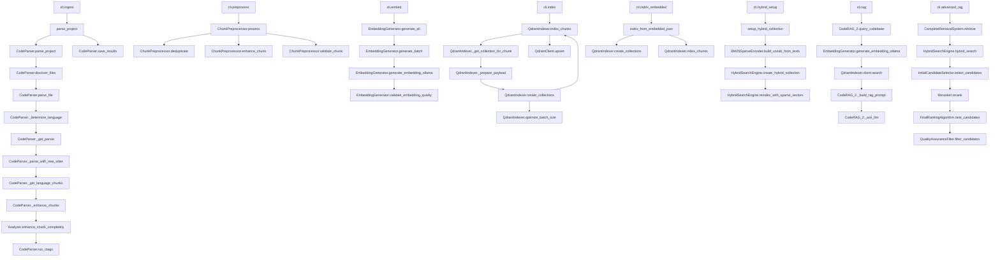

# RAG Indexing Function Call Diagram

## Description of the RAG Indexing Process

The RAG indexing process involves several key stages:

1. **Ingestion**: Parsing the project using Tree-sitter to extract code chunks
2. **Preprocessing**: Deduplicating and enhancing chunks for better embeddings
3. **Embedding**: Generating vector embeddings for each chunk using local models
4. **Indexing**: Storing embeddings in Qdrant vector database collections
5. **Retrieval**: Using the indexed data for semantic search queries

The diagram shows the main functions involved at each stage, with arrows indicating function calls between them.